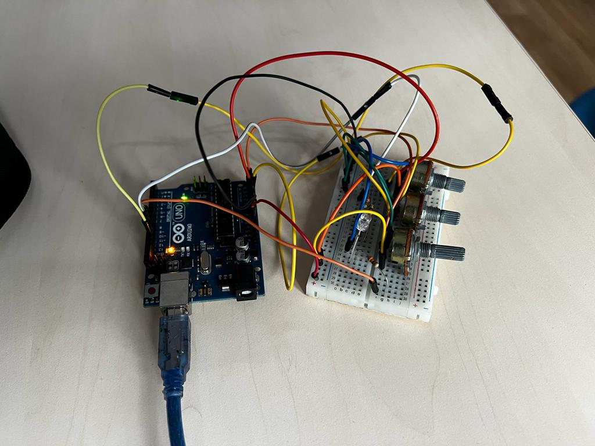

# Introduction to Robotics :robot: (2023 - 2024)

Welcome to my repository dedicated to showcasing the projects and assignments I've undertaken during the Unibuc "Introduction to Robotics" course. Each homework includes requirements, implementation details, code and image files.

## Homework 1

## Requirement

This assignment focuses on controlling each channel (Red, Green, and Blue) of an RGB LED using individual potentiometers. This control must leverage digital electronics. Specifically, you need to read the potentiometer’s value with Arduino and then write a mapped value to the LED pins.

## Setup photo

## Video
https://youtu.be/XIchfaqgl78
