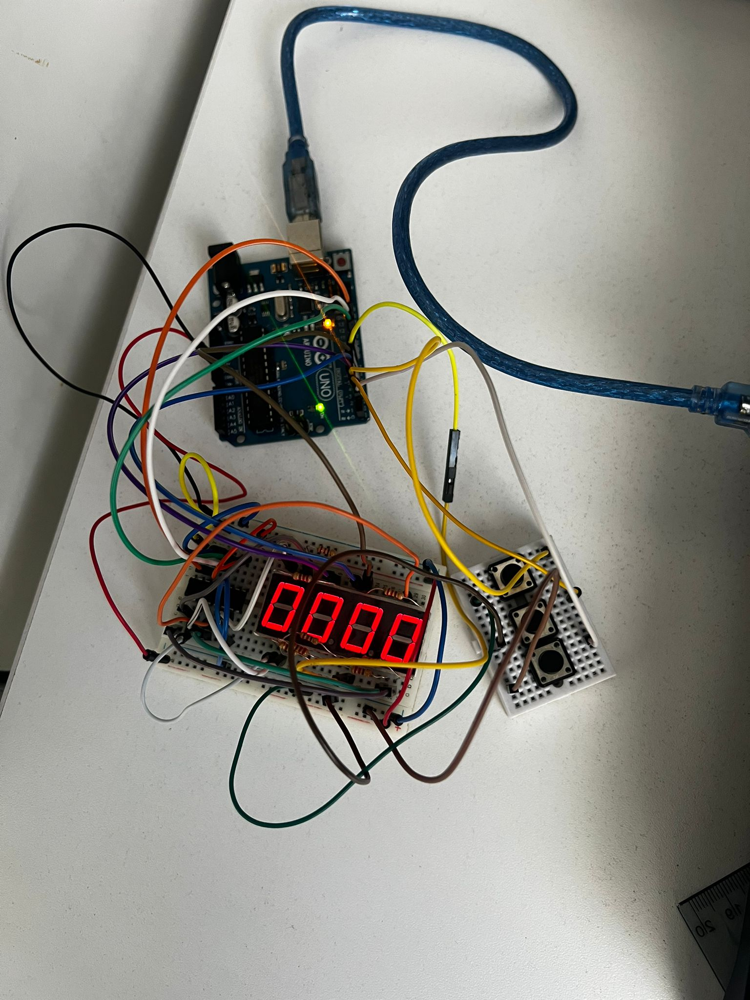

# Introduction to Robotics :robot: (2023 - 2024)

Welcome to my repository dedicated to showcasing the projects and assignments I've undertaken during the Unibuc "Introduction to Robotics" course. Each homework includes requirements, implementation details, code and image files.

## Homework 1

## Requirement

This assignment focuses on controlling each channel (Red, Green, and Blue) of an RGB LED using individual potentiometers. This control must leverage digital electronics. Specifically, you need to read the potentiometer’s value with Arduino and then write a mapped value to the LED pins.

## Setup photo

## Video
https://youtu.be/XIchfaqgl78

## Homework 2

## Requirement 

This assignment involves simulating a 3-floor elevator control system using LEDs and buttons with Arduino. Here are the specific requirements:
LED Indicators: Each of the 3 LEDs should represent one of the 3 floors. The LED corresponding to the current floor should light up. Additionally, another LED should represent the elevator’s operational state. It should blink when the elevator is moving and remain static when stationary.
Buttons: Implement 3 buttons that represent the call buttons from the 3 floors. When pressed, the elevator should simulate movement towards the floor after a short interval (2-3 seconds).
State Change & Timers: If the elevator is already at the desired floor, pressing the button for that floor should have no effect. Otherwise, after a button press, the elevator should ”wait for the doors to close” and then ”move” to the corresponding floor. If the elevator is in movement, it should either do nothing or it should stack its decision (get to the first programmed floor, open the doors, wait, close them and then go to the next desired floor).
Debounce: Remember to implement debounce for the buttons to avoid unintentional repeated button presses.

## Setup photo

## Video
https://youtu.be/vmzClBIFp00

## Homework 3

## Requirement
This assignment involves using a  joystick to control the position of the segment and ”draw” on the display. The movement between segments should be natural, meaning they should jump from the current position only to neighbors, but without passing through ”walls”. The initial position should be on the DP. The current
position always blinks (irrespective of the fact that the segment is on or off). Short pressing the button toggles the segment state from ON to OFF or from OFF to ON. Long pressing the button resets the entire display by turning all the segments OFF and moving the current position to the decimal point.

## Setup photo

## Video
https://youtu.be/bwCRDn86FSA

## Homework 4

## Requirement
This assignment involves implementing a stopwatch timer using the 4 digit 7 segment display and 3 buttons that counts in 10ths of a second and has a save lap functionality (similar to most basic stopwatch functions on most phones). The starting value of the 4 digit 7 segment display should be ”000.0”.
### Buttons
  1. Start / pause.
  2. Reset (if in pause mode). Reset saved laps (if in lap) viewing mode).
  3. Save lap (if in counting mode), cycle through last saved laps (up to 4 laps).

## Setup photo

## Video
https://youtu.be/XyXWkvGYfag

## Homework 6

## Requirement
This assignment involves developing a small game on the 8x8 matrix.  The game have 3 types of elements: player (blinks slowly), bombs (blinks fast), wall (doesn’t blink). For this assignment i choosed to implement bomberman style to destroy walls

## Setup photo

## Video
https://youtu.be/vYYiYmJx__o
